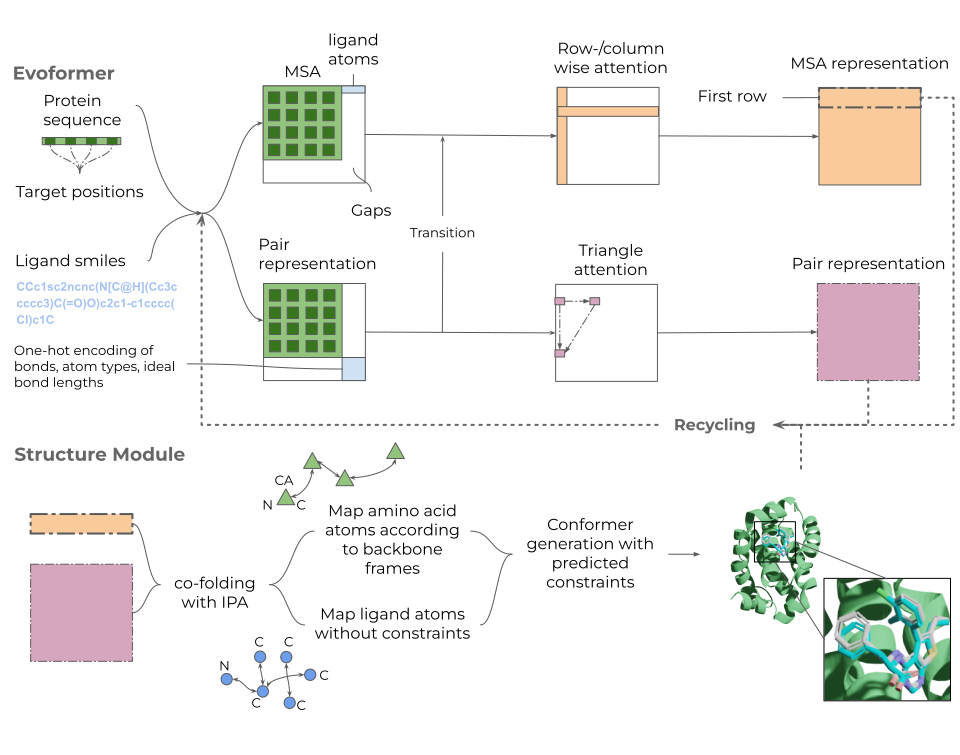

# Umol
## Structure prediction of protein-ligand complexes from sequence information



Umol is available under the [Apache License, Version 2.0](http://www.apache.org/licenses/LICENSE-2.0). \
The Umol parameters are made available under the terms of the [CC BY 4.0 license](https://creativecommons.org/licenses/by/4.0/legalcode).

# Local installation
The entire installation takes <1 hour on a standard computer. \
The runtime will depend on the GPU you have available and the size of the protein-ligand complex you are predicting. \
On an NVIDIA A100 GPU, the prediction time is a few minutes on average.


## Install Python packages (several minutes)
* For the python environment, we recommend to install it with pip as described below. \
You can do this in your virtual environment of choice.

```
pip install -U jaxlib==0.3.24+cuda11.cudnn82 -f https://storage.googleapis.com/jax-releases/jax_cuda_releases.html
pip install jax==0.3.24
pip install ml-collections==0.1.1
pip install dm-haiku==0.0.9
pip install pandas==1.3.5
pip install biopython==1.81
pip install chex==0.1.5
pip install dm-tree==0.1.8
pip install immutabledict==2.0.0
pip install numpy==1.21.6
pip install scipy==1.7.3
pip install tensorflow==2.11.0
pip install optax==0.1.4
pip install rdkit-pypi
```

You also have to install a conda environment for OpenMM used in the protein relaxation.
To do this, first install miniconda, see: https://docs.conda.io/projects/miniconda/en/latest/miniconda-install.html

```
conda create -c conda-forge --name openmm openmm
conda activate openmm #Assumes you have conda in your path
conda install -c conda-forge openff-toolkit
conda install -c conda-forge pdbfixer
pip install --upgrade lxml
```

## Get network parameters for Umol (a few minutes)

```
wget https://zenodo.org/records/10048543/files/params40000.npy
mkdir data/params
mv params40000.npy  data/params/
```


## Get Uniclust30 (10-20 minutes depending on bandwidth)
25 Gb download, 87 Gb extracted
```
wget http://wwwuser.gwdg.de/~compbiol/uniclust/2018_08/uniclust30_2018_08_hhsuite.tar.gz --no-check-certificate
mkdir data/uniclust30
mv uniclust30_2018_08_hhsuite.tar.gz data/uniclust30
tar -zxvf data/uniclust30/uniclust30_2018_08_hhsuite.tar.gz
```

## Install HHblits (a few minutes)
```
git clone https://github.com/soedinglab/hh-suite.git
mkdir -p hh-suite/build && cd hh-suite/build
cmake -DCMAKE_INSTALL_PREFIX=. ..
make -j 4 && make install
cd ..
```

# Run the test case
```
ID=7NB4
FASTA=./data/test_case/7NB4/7NB4.fasta
POCKET_INDICES=./data/test_case/7NB4/7NB4_pocket_indices.npy #Zero indexed numpy array of what residues are in the pocket
LIGAND_SMILES='CCc1sc2ncnc(N[C@H](Cc3ccccc3)C(=O)O)c2c1-c1cccc(Cl)c1C' #Make sure these are canonical as in RDKit
UNICLUST=./data/uniclust30_2018_08/uniclust30_2018_08
OUTDIR=./data/test_case/7NB4/
```
## Search Uniclust30 with HHblits to generate an MSA (a few minutes)
```
HHBLITS=./hh-suite/build/bin/hhblits
$HHBLITS -i $FASTA -d $UNICLUST -E 0.001 -all -oa3m $OUTDIR/$ID'.a3m'
```

## Generate input feats (seconds)
```
python3 ./src/make_msa_seq_feats.py --input_fasta_path $FASTA \
--input_msas $OUTDIR/$ID'.a3m' \
--outdir $OUTDIR

python3 ./src/make_ligand_feats.py --input_smiles $LIGAND_SMILES \
--outdir $OUTDIR
```

## Predict (a few minutes)
```
MSA_FEATS=$OUTDIR/msa_features.pkl
LIGAND_FEATS=$OUTDIR/ligand_inp_features.pkl
PARAMS=data/params/params40000.npy
NUM_RECYCLES=3

python3 ./src/predict.py --msa_features  $MSA_FEATS \
--ligand_features $LIGAND_FEATS \
--id $ID \
--ckpt_params $PARAMS \
--target_pos $POCKET_INDICES \
--num_recycles $NUM_RECYCLES \
--outdir $OUTDIR

wait
RAW_PDB=$OUTDIR/$ID'_pred_raw.pdb'
python3 ./src/relax/align_ligand_conformer.py --pred_pdb $RAW_PDB \
--ligand_smiles $LIGAND_SMILES --outdir $OUTDIR

grep ATOM $OUTDIR/$ID'_pred_raw.pdb' > $OUTDIR/$ID'_pred_protein.pdb'
echo "The unrelaxed predicted protein can be found at $OUTDIR/$ID'_pred_protein.pdb' and the ligand at $OUTDIR/$ID'_pred_ligand.sdf'"
```

## Relax the protein (a few minutes)
This fixes clashes mainly in the protein, but also in the protein-ligand interface.
```
conda activate openmm #Assumes you have conda in your path
PRED_PROTEIN=$OUTDIR/$ID'_pred_protein.pdb'
PRED_LIGAND=$OUTDIR/$ID'_pred_ligand.sdf'
RESTRAINTS="CA+ligand" # or "protein"

python3 ./src/relax/openmm_relax.py --input_pdb $PRED_PROTEIN \
                        --ligand_sdf $PRED_LIGAND \
                        --file_name $ID \
                        --restraint_type $RESTRAINTS \
                        --outdir $OUTDIR

#Deactivate conda - only for the relaxation
conda deactivate
RAW_COMPLEX=$OUTDIR/$ID'_pred_raw.pdb'
RELAXED_COMPLEX=$OUTDIR/$ID'_relaxed_complex.pdb'
python3 ./src/relax/add_plddt_to_relaxed.py  --raw_complex $RAW_COMPLEX \
--relaxed_complex $RELAXED_COMPLEX  \
--outdir $OUTDIR
echo "The final relaxed structure can be found at $OUTDIR/$ID'_relaxed_plddt.pdb'"
```
